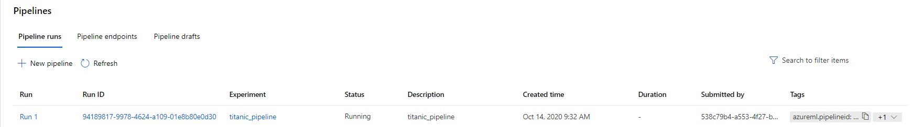
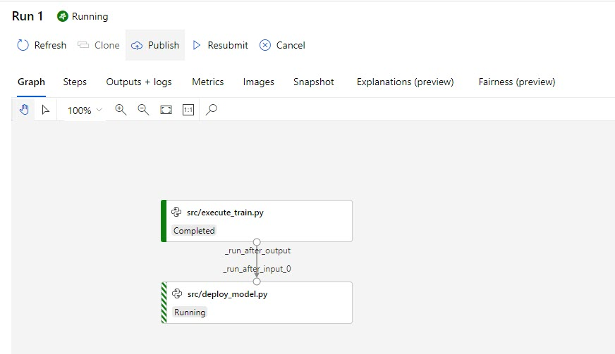

# Create an Azure Machine Learning Pipeline

Azure machine learning pipelines are an execellent way to orchestrate data tasks and automate many of the administrative needs surrounding the deployment and scoring of machine learning solutions.  

In this section we will create a pipeline that will automate the training of a machine learning model and the deployment of the model to the API. Essentially, this pipeline will convert all of the previous code into an automated process.  


Please reference (deploy_pipeline.py)[../code/deploy_pipeline.py]. This code should be executed locally to create, schedule, and submit a pipeline.  

1. Connect to your AML Workspace using the local configuration file.  
```python
import os 

import azureml.core
from azureml.core.compute import ComputeTarget
from azureml.core import Workspace, Environment, Experiment, Run
from azureml.core.authentication import ServicePrincipalAuthentication
from azureml.pipeline.steps import PythonScriptStep
from azureml.pipeline.core import Pipeline, StepSequence, PublishedPipeline
from azureml.core.runconfig import RunConfiguration
from azureml.pipeline.core.schedule import ScheduleRecurrence, Schedule


ws = Workspace.from_config()
kv = ws.get_default_keyvault()

exp_name = 'titanic_pipeline'
workspace_name = ws.name
subscription_id = kv.get_secret('subscriptionId')
resource_group = kv.get_secret('resourceGroup')
tenant_id = kv.get_secret('tenantId')
client_id = kv.get_secret('clientId')
client_secret = kv.get_secret('clientSecret')
print("Azure ML SDK Version: ", azureml.core.VERSION)

```


1. Next we will set some basic variables i.e. which compute we want the pipeline to run on and which environment we want to use. You will notice that we will use the same environment that we registered in the (create_environment.py)[../code/create_environment.py] script. 
    ```python
    # identify compute target
    compute_target = ComputeTarget(ws, name='cpu-cluster')

    aml_run_config = RunConfiguration()
    aml_run_config.environment = Environment.get(workspace=ws, name="sklearn-env")
    aml_run_config.target = compute_target

    ```


1. Our pipeline will have two steps and both will be Python scripts.  
    ```python
    train_model = PythonScriptStep(
        script_name='src/execute_train.py',
        compute_target=compute_target,
        runconfig=aml_run_config
    )


    deploy_model = PythonScriptStep(
        script_name="src/deploy_model.py",
        compute_target=compute_target,
        runconfig=aml_run_config
    )
    ```

1. Next we will create our pipeline. Notice taht we use a StepSequence class which allows us to state that the deploy_model step is executed once the train_model step is complete. If we did not use this class then the pipeline would execute them in parallel.  
    ```python
    steps = [train_model, deploy_model]
    step_seq = StepSequence(steps=steps)
    pipeline = Pipeline(workspace=ws, steps=step_seq)
    ```

1. Once we have created our pipeline locally we can publish it to our workspace.  
    ```python
    pp = pipeline.publish(
        name="TitanicDeploymentPipeline",
        description="Training and deployment pipeline for our titanic API.",
        version="1.0")
    ```


1. Next we will setup the pipeline on a monthly schedule that runs the first of every month.  
    ```python
    # We can also set up a trigger based schedule using the Datastore class - https://docs.microsoft.com/en-us/azure/machine-learning/how-to-schedule-pipelines#create-a-time-based-schedule
    recurrence = ScheduleRecurrence(frequency="Month", interval=1, start_time='2020-11-01T00:00:00')
    recurring_schedule = Schedule.create(ws, name="TitanicRetrainingSchedule", 
                                description="Once a month training",
                                pipeline_id=pp.id, 
                                experiment_name=exp_name, 
                                recurrence=recurrence)

    ```


1. Now let's see the pipeline in action.  We will submit and monitor the pipeline using the SDK.  
    ```python
    run = pp.submit(ws, experiment_name=exp_name)

    run_id = run.id
    exp = Experiment(ws, exp_name)
    r = Run(exp, run_id)
    r.get_details()
    ```

Now if we navigate to the workspace we can see the pipeline run in the portal.  


If we click into the pipeline run (click the Run Id) then we can see the graph of the pipeline. You can see that we are currently training a model.    


You have now created a pipeline that will execute once a month to train and deploy a machine learning model as a web service!  