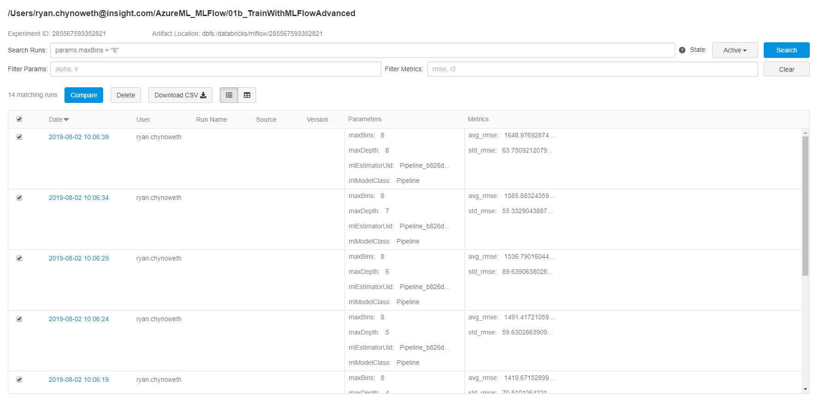
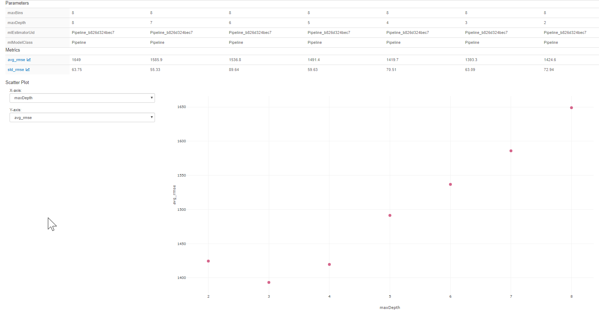

# Cross Validation with MLlib and MLFlow

In this section of the demo I want to highlight how MLFlow integrates with mllibs hyper-parameter tuning capabilities within a Databricks Notebook. Cross-validation is the most common method to finding the appropriate hyper-parameters for your solution.  


1. Create a python notebook called [CV_MLFlow](../Code/01b_TrainWithMLFlow.py).

1. Import the following libraries. You will notice we will using a cross validation function with a decision tree model. 
    ```python
    import mlflow
    from mlflow.tracking import MlflowClient
    from pyspark.ml.regression import DecisionTreeRegressor
    from pyspark.ml.evaluation import RegressionEvaluator
    from pyspark.ml import Pipeline
    import datetime as dt
    from pyspark.ml.feature import OneHotEncoder, VectorAssembler

    from pyspark.ml.tuning import CrossValidator, ParamGridBuilder 
    ```

1. Since we create a Databricks cluster with Databricks Runtime 5.4ML we can automatically enable MLFlow to track our MLlib models, which is extremely helpful when we are doing cross validation.  
    ```python
    spark.conf.set("spark.databricks.mlflow.trackMLlib.enabled", "true")
    ```

1. Similar to our first MLFlow example, we will need to create an MLFlow Client and connect to our experiment in order to create a run. 
    ```python
    client = MlflowClient() # client
    exps = client.list_experiments() # get all experiments

    exp = [s for s in exps if "/Users/{}/exps/MLFlowExp".format(spark.conf.get("com.databricks.demo.username")) in s.name][0] # get only the exp we want
    exp_id = exp.experiment_id # save exp id to variable
    artifact_location = exp.artifact_location # artifact location for storing
    run = client.create_run(exp_id) # create the run
    run_id = run.info.run_id # get the run id

    # start and mlflow run
    mlflow.start_run(run_id)
    ```

1. Lets read in our dataset, split our data, and perform one hotencoding on a few of our features. 
    ```python
    df = (spark
        .read
        .format("csv")
        .option("inferSchema", "True")
        .option("header", "True")
        .load("/databricks-datasets/bikeSharing/data-001/day.csv")
        )
    # split data
    train_df, test_df = df.randomSplit([0.7, 0.3])

    # One Hot Encoding
    mnth_encoder = OneHotEncoder(inputCol="mnth", outputCol="encoded_mnth")
    weekday_encoder = OneHotEncoder(inputCol="weekday", outputCol="encoded_weekday")

    # set the training variables we want to use
    train_cols = ['encoded_mnth', 'encoded_weekday', 'temp', 'hum']

    # convert cols to a single features col
    assembler = VectorAssembler(inputCols=train_cols, outputCol="features")
    ```

1. We will set up our decision tree model as a pipeline, and create a grid that our cross validator will use to tune hyper-parameters.   
    ```python

    dt = DecisionTreeRegressor(featuresCol="features", labelCol="cnt")


    # Create pipeline
    pipeline = Pipeline(stages=[
        mnth_encoder,
        weekday_encoder,
        assembler,
        dt
    ])


    grid = (ParamGridBuilder()
    .addGrid(dt.maxDepth, [2, 3, 4, 5, 6, 7, 8])
    .addGrid(dt.maxBins, [2, 4, 8])
    .build())
    ```

1. We need an evaluation metric to use while we perform cross validation. We will use the root mean squared error.  
    ```python
    valid_eval =  RegressionEvaluator(labelCol = "cnt", predictionCol = "prediction", metricName="rmse")

    ```

1. Now lets create our CrossValidator object and train our models!
    ```python
    cv = CrossValidator(estimator=pipeline, evaluator=valid_eval, estimatorParamMaps=grid, numFolds=3)


    cvModel = cv.fit(train_df)
    mlflow.set_tag('owner_team', "<Your name here>")
    test_metric = valid_eval.evaluate(cvModel.transform(test_df))
    mlflow.log_metric('test_' + valid_eval.getMetricName(), test_metric) # Logs additional metrics
    ```
    Now in the top right corner of your databricks notebook you can select the **runs**, and click on the top run available. You will see a list of all the runs you just executed via cross validation. Filter the runs so that we are looking at `params.maxBins="8"`, select all the runs, and click **compare**. Please reference the screenshot below.    
    


    By doing we are able to compare a number of runs where the `maxBins` was 8, and see the effect that the depth has on our model performance. In the image below we can see that a `maxDepth` of 3 performed the best.  
    


1. Finally, lets end our MLFlow Run.  
    ```python
    mlflow.end_run(status="FINISHED")
    ```

In the [next section](04_TrainWithBoth.md) we repeat our cross validation we just did, however, we use the Azure Machine Learning integration in MLFlow to track our child runs.  