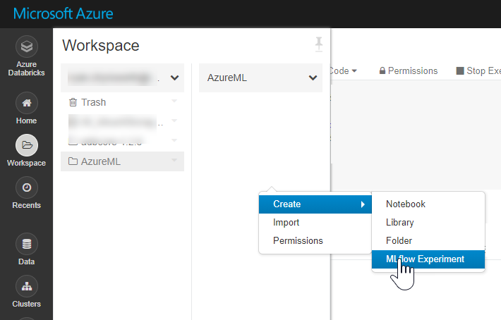
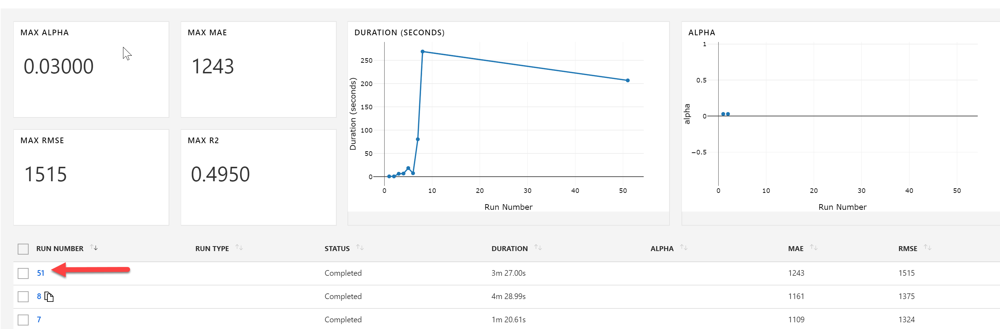
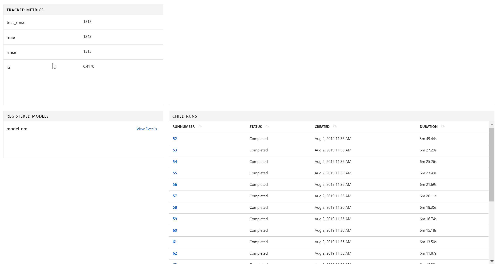

# Using MLFlow with the Azure Machine Learning Service

This section of the demo highlights how users can use Azure Machine Learning as the service endpoint for your MLFlow Experiments. In my honest opinion, I believe there is not a huge advantage to this capabilities because it is just much easier to use the Azure ML SDK.  


1. Let's create a notebook called [`TrainWithAMLandMLFlow`](../Code/03_TrainWithAMLandMLFlow.py).  

1. Import our libraries. 
    ```python
    import mlflow
    from mlflow.tracking import MlflowClient
    import azureml
    from azureml.core import Workspace, Run, Experiment

    import os, shutil

    from pyspark.ml.regression import DecisionTreeRegressor
    from pyspark.ml.evaluation import RegressionEvaluator
    from pyspark.ml import Pipeline
    import datetime as dt
    from pyspark.ml.feature import OneHotEncoder, VectorAssembler
    from pyspark.ml.tuning import CrossValidator, ParamGridBuilder 
    ```

1. Next lets connect to our Azure ML Workspace.  
    ```python
    # set aml workspace parameters here. 
    subscription_id = ""
    resource_group = ""
    workspace_name = ""
    workspace_region = ""

    ws = Workspace(subscription_id = subscription_id, resource_group = resource_group, workspace_name = workspace_name)
    ```

1. This is the key step, we must set our mlflow tracking uri to be our Azure ML Workspace.  
    ```python
    mlflow.set_tracking_uri(ws.get_mlflow_tracking_uri())
    ```

1. Next we will want to create a new MLFlow Experiment in Azure Databricks. We will call this experiment `bikeSharingDemandMLFlowAML` and set the artifact location to `dbfs:/mnt/<storage_name>/<container_name>/MLFlowExp`.  
    

1. Next We need to connect to our workspace in AzureML.  
    ```python
    # create experiment
    experiment_name = 'bikeSharingDemandMLFlowAML'
    exp = Experiment(workspace=ws, name=experiment_name)
    ```

1. Run the following command to enable tracking of our mllib machine learning model.  
    ```python
    spark.conf.set("spark.databricks.mlflow.trackMLlib.enabled", "true")
    ```
    
1. Similarly to our original MLFlow notebook we will start our run using the mlflow library.  
    ```python
    mlflow.set_experiment(experiment_name)

    run = mlflow.start_run()
    run_id = run.info.run_uuid
    exp_id = run.info.experiment_id
    artifact_location = run.info.artifact_uri
    ```

1. We will want to use some of the Azure ML functionality so we can get the Azure ML Run object with the following code.  
    ```python
    azRun = Run(exp, run_id)
    ```

    Note that both the `run` and `azRun` objects reference the same run in our Azure ML Workspace, they simply give us access to a different set of APIs we can interact with.  


1. Now we will train our model, please note that we are using the MLFlow library to log values.  
    ```python
    df = (spark
        .read
        .format("csv")
        .option("inferSchema", "True")
        .option("header", "True")
        .load("/databricks-datasets/bikeSharing/data-001/day.csv")
        )
    # split data
    train_df, test_df = df.randomSplit([0.7, 0.3])

    # One Hot Encoding
    mnth_encoder = OneHotEncoder(inputCol="mnth", outputCol="encoded_mnth")
    weekday_encoder = OneHotEncoder(inputCol="weekday", outputCol="encoded_weekday")

    # set the training variables we want to use
    train_cols = ['encoded_mnth', 'encoded_weekday', 'temp', 'hum']

    # convert cols to a single features col
    assembler = VectorAssembler(inputCols=train_cols, outputCol="features")

    # Set model
    dt = DecisionTreeRegressor(featuresCol="features", labelCol="cnt")

    # Create pipeline
    pipeline = Pipeline(stages=[
        mnth_encoder,
        weekday_encoder,
        assembler,
        dt
    ])
    ```

1. Now to perform the cross validation we will repeat our grid, evaluation metric, and setup the cross validator object.  
    ```python
    grid = (ParamGridBuilder()
    .addGrid(dt.maxDepth, [2, 3, 4, 5, 6, 7, 8])
    .addGrid(dt.maxBins, [2, 4, 8])
    .build())

    valid_eval =  RegressionEvaluator(labelCol = "cnt", predictionCol = "prediction", metricName="rmse")

    cv = CrossValidator(estimator=pipeline, evaluator=valid_eval, estimatorParamMaps=grid, numFolds=3)
    ```

1. Now lets log our metrics and set a tag.  
    ```python
    cvModel = cv.fit(train_df)
    mlflow.set_tag('owner_team', "Ryan") # Logs user-defined tags
    test_metric = valid_eval.evaluate(cvModel.transform(test_df))
    mlflow.log_metric('test_' + valid_eval.getMetricName(), test_metric) # Logs additional metrics
    ```

1. We will gather a few more evaluation metrics before we end our run.  
    ```python
    # write test predictions to datetime and lastest folder
    predictions = cvModel.transform(test_df)
    # mlflow log evaluations
    evaluator = RegressionEvaluator(labelCol = "cnt", predictionCol = "prediction")

    mlflow.log_metric("mae", evaluator.evaluate(predictions, {evaluator.metricName: "mae"}))
    mlflow.log_metric("rmse", evaluator.evaluate(predictions, {evaluator.metricName: "rmse"}))
    mlflow.log_metric("r2", evaluator.evaluate(predictions, {evaluator.metricName: "r2"}))
    ```

1. To save our model for later use, we will use the `bestModel` property in the CrossValidatorModel object. Please note that this model is considered best based off the *single* evaluation metric that you provided.    
    ```python
    bestModel = cvModel.bestModel
    ```

1.  Similar to our Azure ML example we will save our model to a temporary local path, then upload and register our model to the Azure ML Workspace. 
    ```python
    # Save locally on DBFS
    model_nm = "bikeshare.mml"
    model_output = '/mnt/azml/outputs/'+model_nm
    model_dbfs = "/dbfs"+model_output
    bestModel.write().overwrite().save(model_output)
    ```

1. Upload and register model, then clean up workspace on Databricks FileSystem. 
    ```python
    model_name, model_ext = model_dbfs.split(".")

    model_zip = model_name + ".zip"
    shutil.make_archive(model_name, 'zip', model_dbfs)
    azRun.upload_file("outputs/" + model_nm, model_zip)

    azRun.register_model(model_name = 'model_nm', model_path = "outputs/" + model_nm)

    # now delete the serialized model from local folder since it is already uploaded to run history 
    shutil.rmtree(model_dbfs)
    os.remove(model_zip)
    ```

1. The cross validator creates many child runs underneath our parent run. We will want to mark the child run complete in our Azure Machine Learning Workspace.  
    ```python
    for a in azRun.get_children():
    Run(exp, a.id).complete()
    ```


1. Finally, we end the run.  
    ```python
    mlflow.end_run()
    ```

1. Now if we navigate our Azure Machine Learning Workspace to our `bikeSharingDemandMLFlowAML` experiment. You will notice that we were able to log and track our model using the MLFlow library. That is the integration between MLFlow and Azure ML.  
    

    If we select the most recent Run Number. Then scroll down the page, we can see all the child runs associated. These were all created, and automatically tracked by MLFlow and logged to our Azure Machine Learning Workspace.  
    