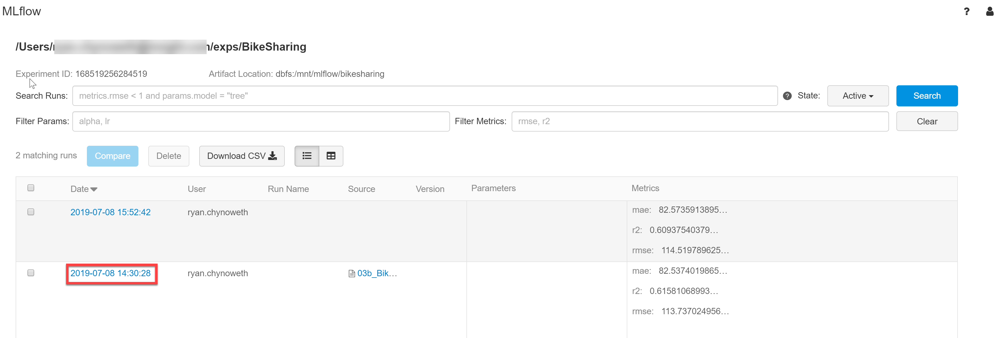
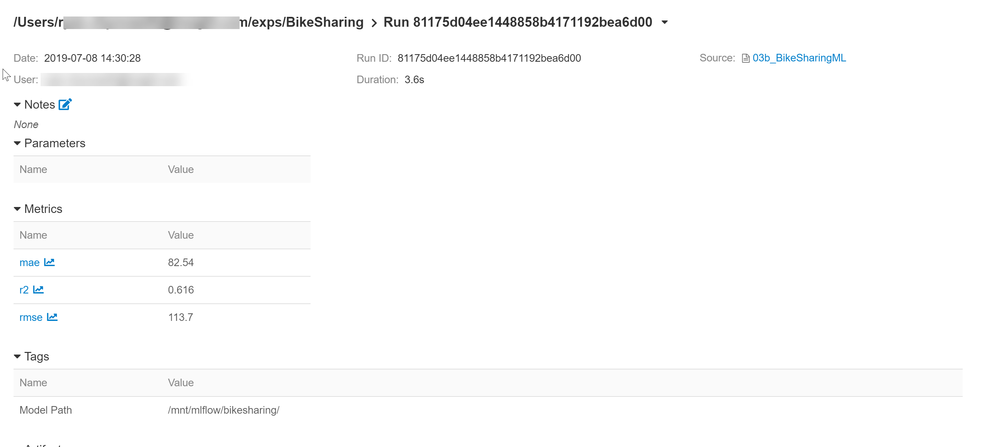
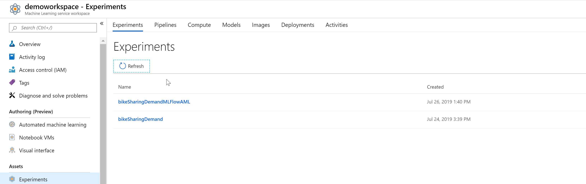
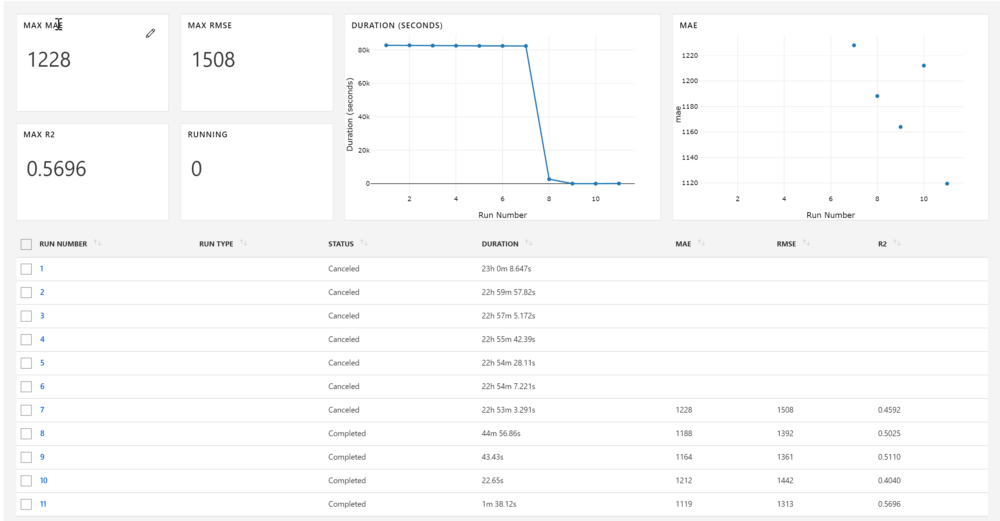
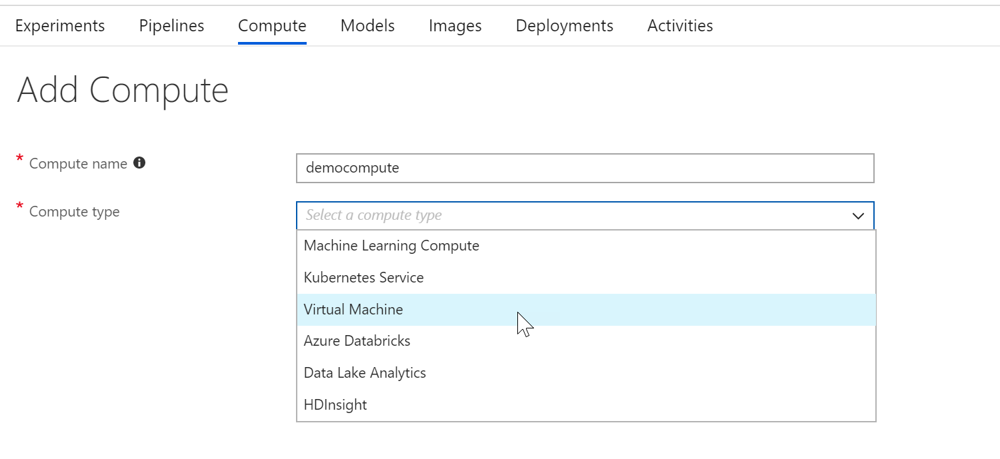
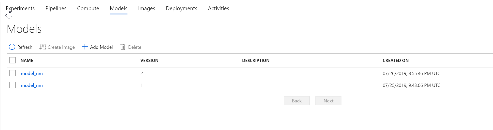
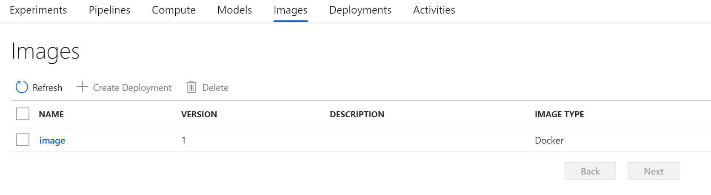

# Azure Machine Learning vs MLFlow

As people create new software they are attempting to solve specific problems, and often when we are reading about these products we generally understand what they are solving. One aspect that may be lacking is a thorough explanation of the problem itself. For example, I often read about how difficult it is to get machine learning models into production (which is true), and there are now an endless number of tools to make the process easier. But what are the pain points of deploying intelligent solutions and can tools really eliminate those areas.  

Machine learning and deep learning models are difficult to get into production due to the highly cyclical development process of data science. As a data scientist I am not only experimenting with different hyperparameters to tune my model, but I am constantly creating or adding new features in my dataset; therefore, I have to keep track of which features, hyperparameters, and the type of model I used is a lot to remember. Additionally, I have to create a model that performs as well as the end user requires. There are a lot of tasks to track and monitoring when developing and deploying machine learning solutions, and tools like [MLFlow](https://www.mlflow.org/) and [Azure Machine Learning](https://docs.microsoft.com/en-us/azure/machine-learning/service/overview-what-is-azure-ml) look to help make this process manageable.  

Once a data scientist develops a machine learning model, the code is rarely production ready and package dependencies are usually a mess. Not only do developers need to clean up the model training script, but they typically need to make big changes in how they clean and acquire data since the historical data used to train is usually easier to load and predict on than the new data to be scored in an application. In addition, to the data acquisition script there is usually a creation of a scoring script that actually makes predictions and returns those predictions to the application. In the end, data science solutions have a lot of moving parts in development and in production. 

For the longest time I would simply suggest that my clients use Azure Machine Learning to track, train, and deploy machine learning solutions. However, as Azure Databricks has become the premier big data and analytics resources in Azure that message has slightly changed. Since MLFlow is integrated into Azure Databricks it has easily become the default platform to manage data science experiments from development to production, however, I believe that Azure Machine Learning is a viable, and often better, tool choice for data scientists. In the demonstration available on my [GitHub](https://github.com/ryanchynoweth44/AzureMachineLearningWithDatabricks/blob/master/AzureMLvsMLFlow/Docs/00_SetUpAzureEnvironment.md) I show users how to train and track machine learning models using MLFlow, Azure Machine Learning, and MLFlow's integration with Azure Machine Learning. If you are looking to deploy models using Azure Databricks and Azure Machine Learning I would check out my [previous demo](https://github.com/ryanchynoweth44/AzureMachineLearningWithDatabricks/blob/master/AzureMLWithAzureDatabricks/walkthrough/03_DeployModel.md) available in the same repository.    

MLFlow is centered around enhancing the engineer's ability to **track experiments** so that they have visibility of performance during both development and production. **Managing models** is simplified by associating them with specific experiment runs, and it packages machine learning code so that it is reusable, **reproduceable**, and shareable  across an organization. With MLFlow a data scientist is able to execute and compare hundreds of training runs in parallel on any compute platform they wish and deploy those models in any manner they desire. MLFlow supports all programming languages through its REST interface, however, R, Python, Java, and Scala are all supported languages out of the box. Below is a screenshot of a MLFlow experiment view in Azure Databricks.  

If I were to select one of my experiment runs by clicking on the execution date hyperlink then I can see more details about the specific run. We also have the ability to select multiple runs and compare them.  

Azure Machine Learning is an enterprise ready tool that integrates seamlessly with your Azure Active Directory and other Azure Services. Similar to MLFlow, it allows developers to train models, deploy them with built in Docker capabilities (please note that you do not have to deploy with Docker), and manage machine learning models in the cloud. Azure machine learning is fully compatible with popular packages like PyTorch, TensorFlow, and scikit-learn, and allows developers to train models locally and scale out to the cloud when needed.   

At a high-level the Azure Machine Learning Service provides a **workspace** that is the central container for all development and artifact storage. Within a workspace a developer will create **experiments** that all scripts, artifacts, and logging is tracked by the usage of experiment **runs**. The most important aspect of data science is our model, the object that takes in our source data and makes predictions. Azure Machine Learning provides a **model registry** that tracks and versions our experiment models making it easier to deploy and audit predictive solutions. One of the most crucial aspects to any machine learning solution is **deployment**. The Azure Machine Learning service allows developers to package their python code as a web service Docker container. These docker images and containers are cataloged an Azure Container Registry that is associated to the Azure Machine Learning Workspace. This give data scientists the ability to track a single training run from development into production by capturing all the training criteria, registering our model, building a container, and creating a deployment. 

Below is a list of my experiments in a demo Azure Machine Learning Workspace.   

By clicking into one of the experiments I am able to see all the runs and view the performance of each run through the values logged using the AzureML Python SDK. Please note that I have the ability to select multiple runs and compare them.   

The above screenshots are very similar to MLFlow, where I believe Azure Machine Learning extends and offers better capabilities is through the Compute, Models, Images, and Deployment tabs in our Azure ML Workspace. 

Either programmatically or using the Azure Portal I am able to create a remote compute target where I can offload my experiment runs from my local laptop, and have everything logged and stored in my workspace.  

By registering models in my workspace I make them available to create a Docker image and deploy as a web service. Developers can either use the Azure ML SDK or the Azure portal to do so. 

Once an image is created I can easily deploy the Docker container anywhere that I can run containers. This can be in Azure, locally, or on the edge! One extremely nice feature built into Azure Machine Learning is the integration with Application Insights allow developers to capture telemetry data about the web service and the model in production.   

Overall, while MLFlow and Azure Machine Learning are two similar two I believe that Azure Machine Learning is slightly more enterprise ready and enables developers to deploy solutions faster. One of the coolest features of MLFlow and Azure Machine Learning is the ability to using MLFlow in union with Azure Machine Learning, which I highlight in my demo. Generally, I recommend to engineers who are developing exclusively on Azure Databricks that the integration with MLFlow is likely much easier to get started and they should take advantage of that, however, if there are possibilities of development in a non-Spark environment I would recommend a tool like Azure Machine Learning. Please check out the example of MLFlow and Azure Machine Learning on Azure Databricks available on my [github](https://github.com/ryanchynoweth44/AzureMachineLearningWithDatabricks)!
