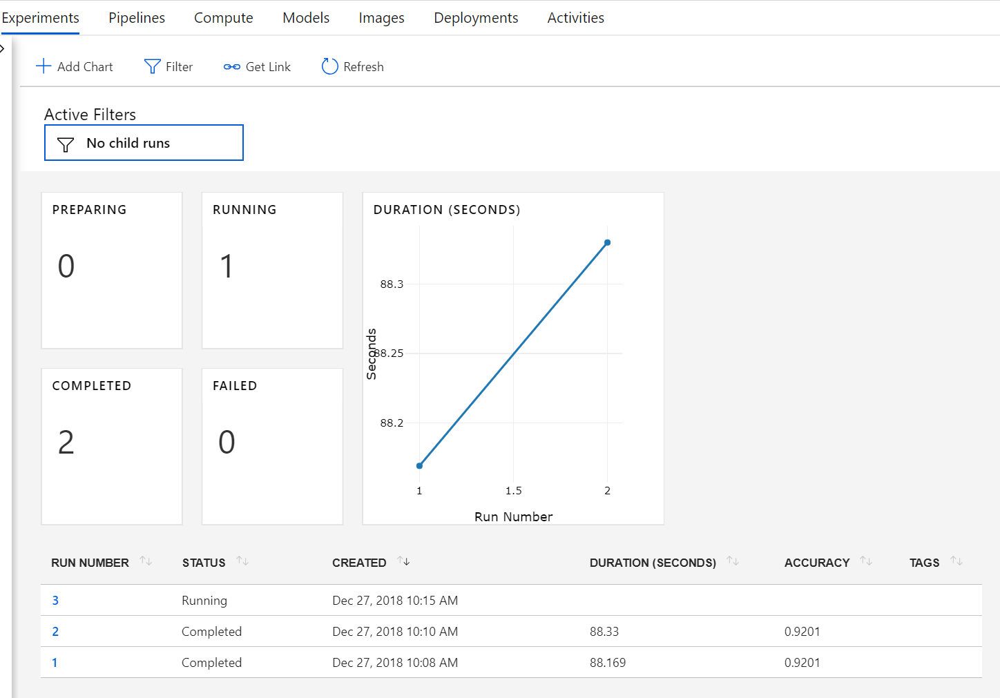

# Train a MNIST Model in Azure Databricks
In this step we will connect to our Azure Machine Learning Workspace and train a machine learning model. Since we are using the Azure Machine Learning service we are logging and tracking our experiment in the cloud.   

## Train Model
1. Import the required libraries 
    ```python 
    import os
    import datetime
    import azureml
    from azureml.core import Workspace, Run, Experiment
    from azureml.train.estimator import Estimator

    import gzip
    import numpy as np
    import struct

    from sklearn.linear_model import LogisticRegression
    from sklearn.externals import joblib


    import matplotlib
    import matplotlib.pyplot as plt

    # check core SDK version number
    print("Azure ML SDK Version: ", azureml.core.VERSION)
    ```

1. Next we need to connect to our Azure Machine Learning Workspace. First set the variables below. Please note that you can use the [Databricks Secrets API](https://docs.databricks.com/api/latest/secrets.html) to securely handle secrets in production environments.   

    ```python 
    # set aml workspace parameters here. 
    subscription_id = "<your-subscription-id>"
    resource_group = "<your-resource-group>"
    workspace_name = "<your-workspace-name>"
    workspace_region = "<your-region>"

    # set container and account name for data sources
    container_name = ""
    account_name = ""
    ```

1. Next connect to your workspace. Please note that you may need to sign in interactively using a browser.  
    ```python
    ws = Workspace(subscription_id = subscription_id, resource_group = resource_group, workspace_name = workspace_name)
    ```

1. Create an experiment to track the runs in your workspace. A workspace can have muliple experiments.
    ```python 
    experiment_name = 'demomnist'

    exp = Experiment(workspace=ws, name=experiment_name)
    ```
1. Our data files are saved as gzip files so we will need a few helper functions to load and manipulate our data. Paste and run the following code to create python functions.  
    ```python 
    # load compressed MNIST gz files and return numpy arrays
    def load_data(filename, label=False):
        with gzip.open(filename) as gz:
            struct.unpack('I', gz.read(4))
            n_items = struct.unpack('>I', gz.read(4))
            if not label:
                n_rows = struct.unpack('>I', gz.read(4))[0]
                n_cols = struct.unpack('>I', gz.read(4))[0]
                res = np.frombuffer(gz.read(n_items[0] * n_rows * n_cols), dtype=np.uint8)
                res = res.reshape(n_items[0], n_rows * n_cols)
            else:
                res = np.frombuffer(gz.read(n_items[0]), dtype=np.uint8)
                res = res.reshape(n_items[0], 1)
        return res


    # one-hot encode a 1-D array
    def one_hot_encode(array, num_of_classes):
        return np.eye(num_of_classes)[array.reshape(-1)]
    ```

1. Lets read our data from blob storage into python Arrays. 
    ```python
    # Load data
    X_train = load_data('/dbfs/mnt/' + account_name + '/' + container_name + '/train-images.gz', False) / 255.0
    y_train = load_data('/dbfs/mnt/' + account_name + '/' + container_name + '/train-labels.gz', True).reshape(-1)
    X_test = load_data('/dbfs/mnt/' + account_name + '/' + container_name + '/test-images.gz', False) / 255.0
    y_test = load_data('/dbfs/mnt/' + account_name + '/' + container_name + '/test-labels.gz', True).reshape(-1)
    ```

1. If you wish you can generate one of the images and display it in your notebook.  
    ```python
    # function to generate an image
    def gen_image(arr):
        two_d = (np.reshape(arr, (28, 28)) * 255).astype(np.uint8)
        plt.imshow(two_d, interpolation='nearest')
        return plt
    # get an image
    img = gen_image(X_train[0])

    # save image as png
    img.savefig('/dbfs/mnt/' + account_name + '/' + container_name + '/sample_mnist_img.png', mode="overwrite")

    # open png and display
    from pyspark.ml.image import ImageSchema
    image_df = ImageSchema.readImages('/mnt/' + account_name + '/' + container_name + '/sample_mnist_img.png')
    display(image_df)
    ```

1. Now lets train and test a machine learning model! We are going to train a simple logistic regression model. Please note that since we connected to our Azure Machine Learning Workspace that this model training is being tracked. I would recommend navigating the Azure Portal and click on your workspace.     
    ```python
    # start the run
    run = exp.start_logging()

    # train a model
    clf = LogisticRegression()
    clf.fit(X_train, y_train) 

    # predict on test
    y_hat = clf.predict(X_test)

    # calculate accuracy on the prediction
    acc = np.average(y_hat == y_test)
        
    run.log('accuracy', np.float(acc))
    os.makedirs('outputs', exist_ok=True)

    # note file saved in the outputs folder is automatically uploaded into experiment record
    joblib.dump(value=clf, filename='outputs/sklearn_mnist_model.pkl')
    ```

1. In the step above we trained a model and saved it locally to a folder on the cluster. We will now want to upload the model and register it to model management. We also save the model to our mounted directory so that we can more easily access the saved model in a databricks environment. Please note that you should save the model to the model management account and a mounted directory so that it is accessible in different environments.    
    ```python
    # upload the model file explicitly into artifacts 
    run.upload_file(name = 'sklearn_mnist_model.pkl', path_or_stream = 'outputs/sklearn_mnist_model.pkl')
    # register the model 
    run.register_model(model_name = 'sklearn_mnist_model.pkl', model_path = 'outputs/sklearn_mnist_model.pkl' )

    # save model to mounted dbfs directory's latest folder
    dbutils.fs.cp("file:" + os.getcwd() + "/outputs/sklearn_mnist_model.pkl", '/dbfs/mnt/' + account_name + '/' + container_name + '/models/latest/sklearn_mnist_model.pkl', True)

    run.take_snapshot('outputs')
    # Complete the run
    run.complete()
    ```

1. Because we are logging and saving everything to our workspace we can navigate the Azure Portal and look at our experiment runs. Here is an example of what mine looks like with two completed runs and one in progress. You can also navigate to the "Models" tab to see the model we just registered to the workspace as well.  
     

1. We have now trained a machine learning model! We have tracked the training and saved our model to our Azure Machine Learning Workspace, therefore, we are ready to prepare and deploy our model! Please complete the [Deploy Model Walkthrough](03_DeployModel.md) to learn how to deploy a model in Azure Databricks and to Azure Container Instance.  